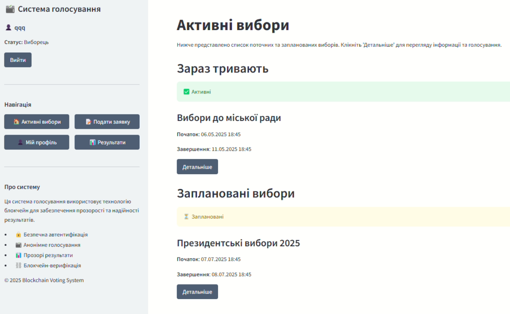

### Тестування нефункціональної вимоги інтерфейсу користувача

**Вимога:**  
Інтерфейс голосування має бути інтуїтивно зрозумілим, з можливістю виконати голосування у кілька кроків.

**Що перевіряється:**  
На головній сторінці користувача доступна навігація по виборах, профілю, подачі заявок та перегляду результатів. У центральній частині демонструється блокчейн, принципи його роботи та поле для демонстрації хешування.

**Як перевірено:**  
Система запущена локально. Нижче наведено знімок екрана, який демонструє реальний інтерфейс системи голосування.

**Знімок екрана:**  

