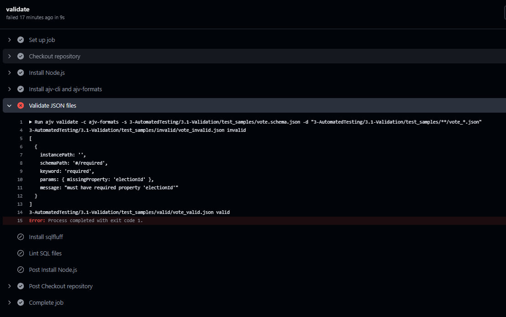
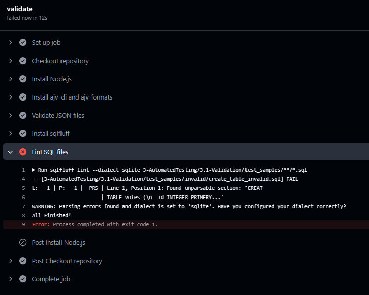

# 3.1 - Автоматизована перевірка норм кодування

Дана частина лабораторної роботи реалізує перевірку правильності структури та форматування файлів на основі вимог до якості коду. Перевірка виконується автоматично при кожному коміті або створенні Pull Request у репозиторій за допомогою GitHub Actions.

## Мета

Забезпечити автоматичну перевірку:
- JSON-файлів згідно з відповідною схемою;
- SQL-файлів на коректність синтаксису та відповідність стилю.

## Інструменти та технології

- GitHub Actions — для автоматичного запуску перевірок;
- ajv-cli — для валідації JSON-файлів;
- sqlfluff — для перевірки SQL на синтаксис і стиль.

## Структура каталогу

Каталог `3.1-Validation` містить такі підкаталоги та файли:

- `.github/workflows/validation.yml` — сценарій GitHub Actions;
- `vote.schema.json` — схема перевірки JSON-файлів;
- `test_samples/valid/vote_valid.json` — приклад коректного JSON;
- `test_samples/valid/create_table_valid.sql` — приклад коректного SQL;
- `test_samples/invalid/vote_invalid.json` — приклад некоректного JSON;
- `test_samples/invalid/create_table_invalid.sql` — приклад некоректного SQL.

## Опис сценарію GitHub Actions

Файл `.github/workflows/validation.yml` запускає наступні перевірки:

1. Перевірка JSON:
   - Встановлюється ajv-cli;
   - Виконується перевірка відповідності JSON-файлів схемі `vote.schema.json`.

2. Перевірка SQL:
   - Встановлюється sqlfluff;
   - Перевіряються всі SQL-файли на синтаксичні та стилістичні помилки.

## Приклади

JSON:
- `vote_valid.json` — коректний файл голосу з усіма обов’язковими полями;
- `vote_invalid.json` — JSON із помилками типів або пропущеними полями.

SQL:
- `create_table_valid.sql` — правильна SQL-структура таблиці `votes`;
- `create_table_invalid.sql` — SQL із синтаксичними помилками.

## Висновок

У результаті реалізовано повністю автоматизовану перевірку норм кодування для SQL та JSON-файлів, що відповідає сучасним практикам CI/CD і забезпечує контроль якості під час розробки.
